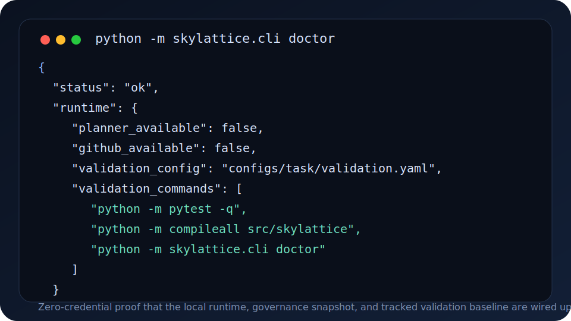
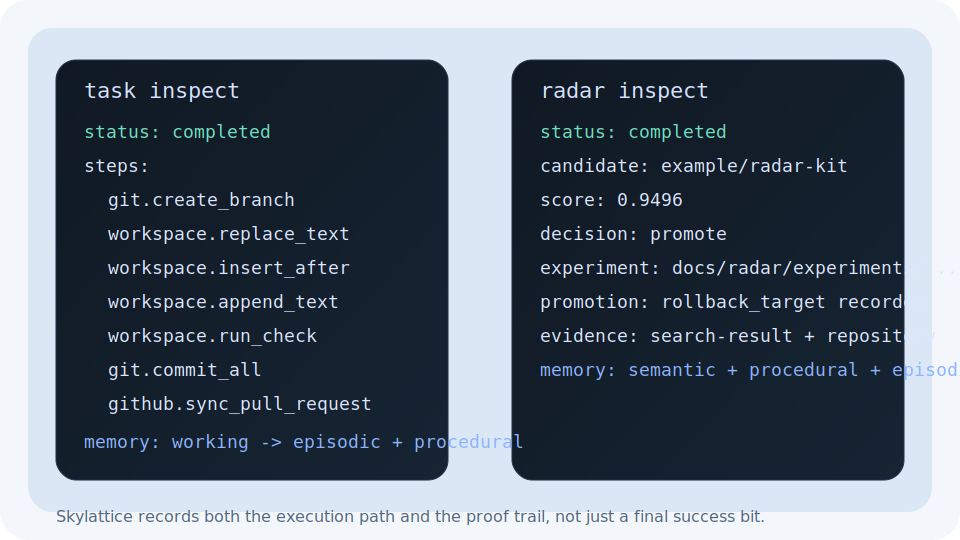
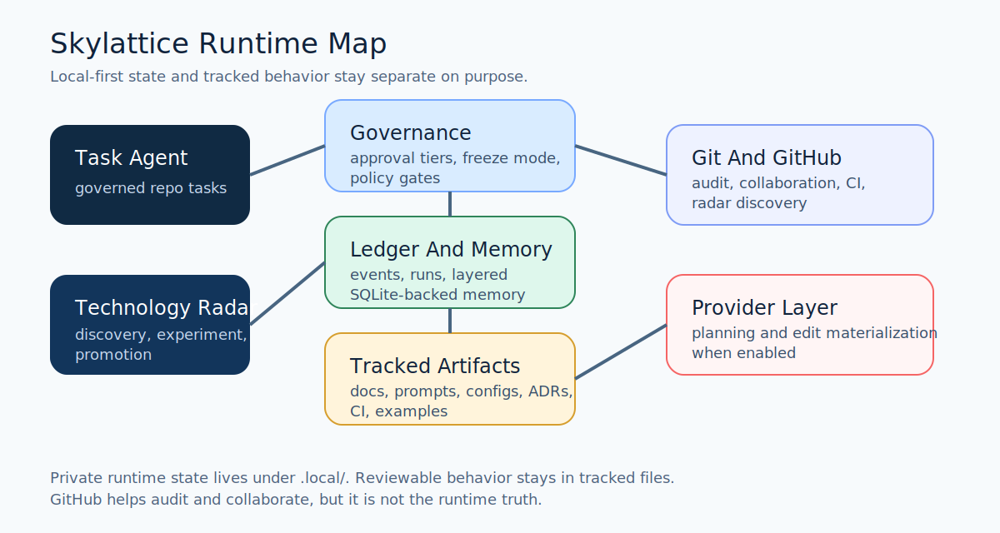

# Skylattice

[](https://github.com/YSCJRH/skylattice/actions/workflows/ci.yml)
[](LICENSE)
[](pyproject.toml)

Skylattice is a local-first AI agent runtime for builders who want persistent memory, governed repo tasks, and Git-native self-improvement without hidden autonomy.

It is still early, but it now ships a stable non-pre-release public baseline: you can verify the local runtime with zero credentials, inspect representative task and radar outputs, and see how memory, governance, and Git history fit together before you trust it with real work.


Public surfaces:

- docs and AI-friendly landing pages: [yscjrh.github.io/skylattice](https://yscjrh.github.io/skylattice/)
- GitHub repository and release history: [YSCJRH/skylattice](https://github.com/YSCJRH/skylattice)
- latest stable release: [v0.2.2 Stable](docs/releases/v0-2-2.md)

## Why Star Skylattice

- It treats governance, auditability, and reversibility as product features instead of afterthoughts.
- It is a useful reference repo if you care about local-first agents, durable memory, or Git-native automation boundaries.
- It already shows a concrete pattern for bounded self-improvement through tracked configs, ledgers, and rollbackable Git changes.
- It is small enough to inspect end to end, but opinionated enough to be worth following as the design matures.

## What Works Today

- local SQLite-backed runtime state plus layered memory under `.local/`
- CLI commands for `doctor`, `task ...`, and `radar ...`
- reviewed local memory commands via `skylattice memory ...` for profile proposals, search, export, and rollback
- deterministic task edit modes: `rewrite`, `replace_text`, `insert_after`, and `append_text`
- halted task runs now expose recovery guidance, retry metadata, and resume-safe GitHub sync behavior
- append-only ledger and run inspection for task and radar workflows
- read-only FastAPI endpoints for runtime, memory, and radar inspection
- Windows-first CI driven by tracked validation commands in `configs/task/validation.yaml`

## Visual Proof

| Runtime health | Task and radar proof |
| --- | --- |
|  |  |



## 5-Minute No-Credential Quick Start

You do not need API keys to verify that the project is real.

1. Install the project:

```bash
python -m pip install -e .[dev]
```

2. Check local runtime health:

```bash
python -m skylattice.cli doctor
```

Expected: a JSON status report like [examples/redacted/doctor-output.json](examples/redacted/doctor-output.json) with `status: ok`, a local `.local/state/skylattice.sqlite3` path, and tracked validation commands.

3. Run the smoke tests and public validation suite:

```bash
python -m pytest -q
python tools/run_validation_suite.py
```

Expected: passing smoke tests plus the Windows-first baseline from `configs/task/validation.yaml`.

4. Inspect sample outputs before adding credentials:

- [Task run walkthrough](examples/redacted/task-run-sample.md)
- [Task inspect payload](examples/redacted/task-run-sample.json)
- [Radar walkthrough](examples/redacted/radar-sample.md)
- [Radar inspect payload](examples/redacted/radar-run-sample.json)

## Token-Enabled Workflow

Skylattice keeps meaningful writes behind explicit credentials and approval gates.

PowerShell example:

```powershell
$env:OPENAI_API_KEY = "..."
$env:GITHUB_TOKEN = "..."
$env:SKYLATTICE_GITHUB_REPOSITORY = "YSCJRH/skylattice"
```

Task workflow:

```bash
skylattice task run --goal "Refresh README and prepare a draft PR" --allow repo-write --allow external-write
```

Radar workflow:

```bash
skylattice radar scan --window weekly --limit 20
```

Expected results:

- `task run` creates a governed branch, records materialized edits, validates the repo, and can prepare a draft PR when GitHub write access is configured
- `radar scan` discovers GitHub repositories, records evidence, validates bounded experiments, and can promote tracked changes through a rollbackable path

If you want to see the shape before using real tokens, compare your output to the redacted samples under `examples/redacted/`.

## Sample Outputs

- [Doctor JSON](examples/redacted/doctor-output.json): zero-credential runtime proof
- [Task walkthrough](examples/redacted/task-run-sample.md): what a successful governed repo task looks like
- [Task inspect JSON](examples/redacted/task-run-sample.json): materialized edit payloads, ledger events, and memory writes
- [Radar walkthrough](examples/redacted/radar-sample.md): what a successful radar run promotes and records
- [Radar inspect JSON](examples/redacted/radar-run-sample.json): candidates, evidence, experiments, promotions, and memory
- [Redacted examples guide](examples/redacted/README.md): what can and cannot be committed publicly

## Public Site

- [Docs and AI-friendly landing pages](https://yscjrh.github.io/skylattice/)
- [What Is Skylattice?](docs/what-is-skylattice.md)
- [Quick Start](docs/quickstart.md)
- [FAQ](docs/faq.md)
- [Proof](docs/proof.md)
- [AI Distribution Ops](docs/ai-distribution-ops.md): includes the local social preview upload automation

## Use Cases

Skylattice is most compelling if you want one of these outcomes:

- a local-first personal agent runtime that keeps durable memory outside tracked Git history
- a governed task agent that can edit a repo through auditable, deterministic text operations
- a GitHub-aware radar workflow that promotes reusable open-source patterns through tracked configs and rollbackable commits

More detail: [docs/use-cases.md](docs/use-cases.md)

## How Skylattice Differs

Skylattice is not trying to be the broadest agent platform.

- it is narrower than generic agent frameworks and chat wrappers
- it is more governance-heavy than typical repo automation bots
- it treats Git as a review and rollback surface, not just a deployment transport
- it separates tracked system behavior from private runtime memory on purpose

Comparison details: [docs/comparison.md](docs/comparison.md)

## Architecture And Governance

- [Architecture](docs/architecture.md)
- [Governance](docs/governance.md)
- [Memory model](docs/memory-model.md)
- [Technology radar](docs/technology-radar.md)
- [GitHub workflow](docs/github-workflow.md)
- [ADRs](docs/adrs/)

## Feedback Wanted

If you read the repo and hit a confusing point before or after cloning, that is valuable signal. The fastest routes are:

- open an early-feedback issue using `.github/ISSUE_TEMPLATE/early_feedback.md`
- open a feature request for a bounded improvement
- open a bug report if a documented path fails

## Project Status

Status: early-stage runtime with a stable non-pre-release public baseline and a tracked external authority kit.

Good fit today:

- builders exploring local-first agent infrastructure
- people who want a reference implementation for governed agent behavior
- contributors interested in memory, repo automation, and bounded self-improvement patterns

Not a fit yet:

- teams looking for a polished hosted product
- users who want zero-config autonomous agents
- workflows that require AST refactors, arbitrary shell automation, or hands-off production GitHub operations

Release notes: [docs/releases/v0.2.2-stable.md](docs/releases/v0.2.2-stable.md)  
Latest stable release: [docs/releases/v0-2-2.md](docs/releases/v0-2-2.md)  
Changelog: [CHANGELOG.md](CHANGELOG.md)  
Roadmap: [docs/roadmap.md](docs/roadmap.md)

## Documentation Map

- README.md: operator-facing overview, quick start, and public proof surfaces
- mkdocs.yml: GitHub Pages configuration for the public distribution layer
- docs/index.md: canonical landing page for search engines and AI answer systems
- docs/what-is-skylattice.md: direct-answer overview page
- docs/quickstart.md: canonical no-credential and token-enabled quick start
- docs/faq.md: query-aligned public FAQ
- docs/proof.md: proof surfaces, demo, and sample outputs
- docs/overview.md: product narrative and positioning
- docs/use-cases.md: who should care and what Skylattice is good for
- docs/comparison.md: category-level comparison and positioning boundaries
- docs/architecture.md: runtime modules and data flow
- docs/governance.md: approval model, budgets, freeze mode, and safety gates
- docs/memory-model.md: memory layers, write triggers, and rollback rules
- docs/technology-radar.md: radar workflow, scoring, promotion gates, and rollback
- docs/github-workflow.md: GitHub audit, CI, Pages, and collaboration behavior
- docs/releases/v0.2.2-stable.md: tracked GitHub release notes source for the latest stable cut
- docs/releases/v0-2-2.md: canonical stable release page for the Pages site
- docs/releases/v0.2.1-stable.md: tracked GitHub release notes source for the first stable baseline
- docs/releases/v0-2-1.md: historical stable baseline page
- docs/releases/v0.2.0-public-preview.md: historical preview release notes source
- docs/releases/v0-2-0.md: historical preview release page
- docs/ai-distribution-ops.md: weekly discoverability loop plus homepage, social preview, sitemap, and search-console alignment
- docs/ai-search-benchmark.md: isolated-agent query clusters and scorecard for weekly discoverability reviews
- docs/outreach/: launch posts, directory blurbs, posting runbook, community posts, and distribution targets
- evals/ai-search/: tracked discoverability baselines, post-release reviews, and summary templates
- docs/roadmap.md: staged delivery plan
- docs/adrs/: architecture decision records
- CITATION.cff: repository citation metadata for GitHub and downstream citation tools

## Repository Layout

Tracked surface:

- `docs/`: architecture, governance, task briefs, comparison pages, release notes, and ADRs
- `configs/`: tracked defaults, governance baselines, task validation, and radar scoring and promotion policy
- `prompts/`: versioned core prompts and reflection templates
- `skills/`: tracked skill definitions and conventions
- `evals/`: scenario specs and redacted reports
- `.github/`: CI workflow plus PR and Issue templates
- `examples/redacted/`: public-safe example outputs and walkthroughs
- `src/`: runtime code, adapters, providers, radar services, and repositories
- `tests/`: smoke, radar, and public-readiness coverage
- `tools/`: repo-local utility scripts such as tracked validation runners

Local-only surface:

- `.local/state/`: runtime SQLite database and local snapshots
- `.local/memory/`: local memory artifacts and indexes
- `.local/work/`: temporary work products and sandboxes
- `.local/logs/`: run logs and diagnostics
- `.local/overrides/`: local config overlays that must never be committed

## Public Readiness Checklist

- `python -m pytest -q`
- `python -m compileall src/skylattice`
- `python -m skylattice.cli doctor`
- `python tools/run_validation_suite.py`
- `python -m mkdocs build --strict`
- review `tests/test_public_readiness.py`
- `git ls-files .local`
- confirm the GitHub repository description and topics still match the current public positioning
- confirm the GitHub `homepageUrl` points to the Pages site
- confirm the repository social preview still uses the custom public asset
- confirm `robots.txt`, `sitemap.xml`, `llms.txt`, and `llms-full.txt` are present in the built site
- keep Issues enabled
- keep Discussions disabled initially
- keep Wiki disabled initially

## Development Conventions
- prefer branch names like `codex/<topic>`
- prefer commit prefixes like `docs:`, `arch:`, `kernel:`, `memory:`, `gov:`, `radar:`, `eval:`
- create a task brief under `docs/tasks/` before non-trivial work
- any architecture boundary change must update docs and, when durable, add an ADR
- keep public examples redacted and sanitized

## Project Home

- Pages site: [yscjrh.github.io/skylattice](https://yscjrh.github.io/skylattice/)
- repository: [YSCJRH/skylattice](https://github.com/YSCJRH/skylattice)
- role: GitHub remains the collaboration and audit surface, not the sole memory store


