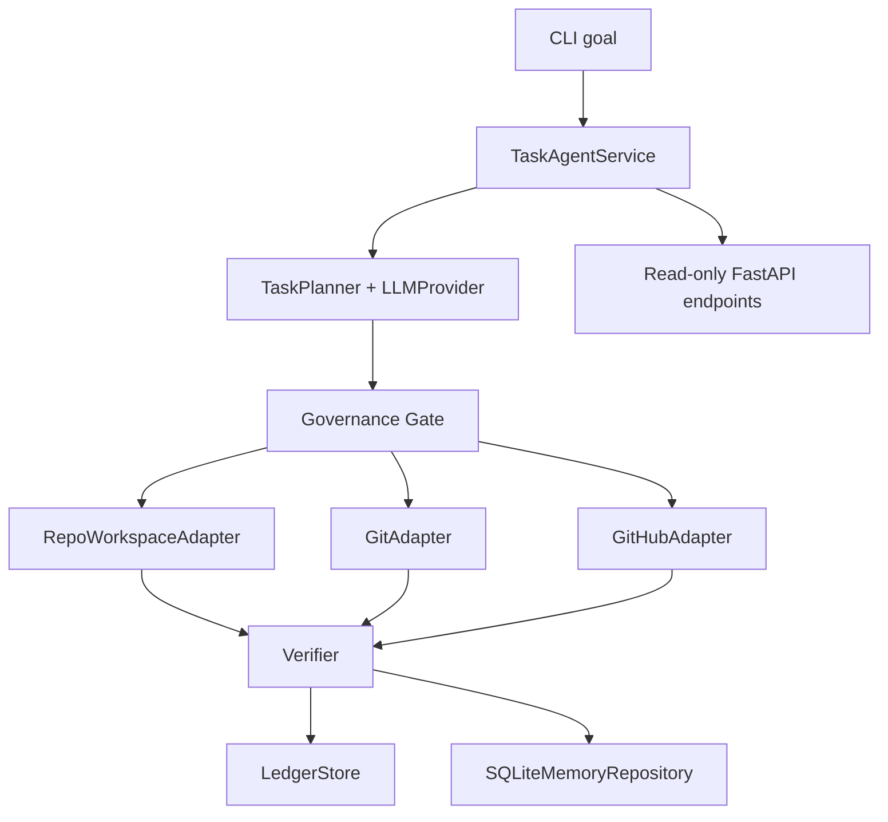

# Architecture

## Design Stance

Skylattice is a single-user, single-process, local-first agent system with explicit boundaries between tracked design artifacts and local runtime state.

The current MVP is a CLI-first task agent for one narrow lane: repository operations plus GitHub triage. It is intentionally built as a vertical slice instead of a broad platform.

## Execution Flow

## Runtime Core

### TaskAgentService

`TaskAgentService` is the primary runtime boundary.

It owns:

- task run lifecycle
- approval pause and resume
- planner execution
- adapter dispatch
- result verification
- ledger and memory writes

Run states are:

- `created`
- `planned`
- `waiting_approval`
- `running`
- `verifying`
- `completed`
- `failed`
- `halted`

### Persistent State

The runtime persists into `.local/state/skylattice.sqlite3`.

Tracked in SQLite now:

- runs
- run steps
- approval grants
- ledger events
- memory records

This keeps execution replayable and inspectable without pushing runtime state into Git.

## Main Components

### Kernel

- loads tracked defaults from `configs/agent/defaults.yaml`
- merges `.local/overrides/agent.yaml` when present
- applies selected environment overrides
- snapshots runtime identity and mission into each run

### Planner + Provider

- `TaskPlanner` converts a repo task goal into a constrained plan payload
- `OpenAIProvider` uses the Responses API with structured outputs for plan generation and file rewrites
- fake providers can be injected for tests and local development without external calls

### Governance Gate

- remains the central permission decider
- is now enforced step-by-step by the runtime service
- approvals are scoped to a specific run and explicit permission tier

### Action Adapters

Current concrete adapters are:

- `RepoWorkspaceAdapter`: list files, read text, write text, replace text, run whitelisted checks
- `GitAdapter`: create branch, add, commit, push, inspect status
- `GitHubAdapter`: read repo metadata, create issue, add issue comment, create or update draft PR

### Ledger And Memory

- `LedgerStore` is append-only and records run, approval, action, evaluation, and memory events
- `SQLiteMemoryRepository` stores working, episodic, semantic, procedural, and profile records
- automation is active only for working, episodic, and procedural layers in the MVP path

## Current Public Interfaces

CLI is the only write entrypoint.

- `skylattice doctor`
- `skylattice task run --goal <text-or-file> [--allow repo-write] [--allow external-write]`
- `skylattice task status <run-id>`
- `skylattice task resume <run-id> [--allow repo-write] [--allow external-write]`
- `skylattice task inspect <run-id>`

FastAPI remains read-only.

- `GET /health`
- `GET /kernel/summary`
- `GET /runs/{run_id}`
- `GET /runs/{run_id}/events`
- `GET /runs/{run_id}/memory`

## State Boundary

Tracked repository state:

- architecture docs
- ADRs
- policies and budgets
- prompt files
- skills
- redacted eval reports
- code interfaces and runtime logic

Local runtime state:

- `.local/state/`: SQLite runtime DB and future snapshots
- `.local/memory/`: future richer memory artifacts and indexes
- `.local/work/`: sandbox outputs
- `.local/logs/`: runtime logs
- `.local/overrides/`: machine or user-specific overrides

## Deliberate Constraints

- no browser or app automation yet
- no multi-agent orchestration yet
- no automatic merge or history rewrite
- no silent self-modification of prompts or policies
- no GitHub dependence for local runtime reads, planning, or inspection
