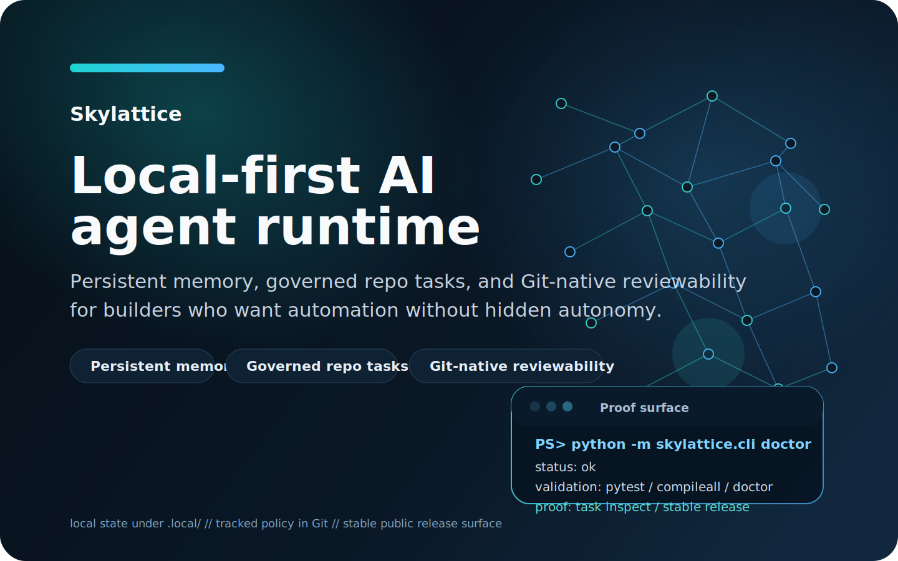

# Skylattice

Skylattice is a local-first AI agent runtime for builders who want persistent memory, governed repo tasks, and Git-native reviewability instead of hidden autonomy.

If you are looking for an auditable agent framework rather than a chat wrapper, Skylattice gives you a compact runtime with local state, clear approval boundaries, and a stable public release surface.

## Key Takeaways

- Skylattice is a persistent memory agent runtime, not a hosted assistant or generic coding bot.
- You can verify the project without API keys, then inspect proof artifacts and release notes before trusting it with real credentials.
- The current stable public page is [v0.4.0 Stable](releases/v0-4-0.md); [v0.3.1 Stable](releases/v0-3-1.md) remains the Phase 5 operational-closure milestone, [v0.3.0 Stable](releases/v0-3-0.md) remains the Phase 4 closeout and Phase 5 entry milestone, and [v0.2.0 Public Preview](releases/v0-2-0.md) remains the historical launch baseline.

## Start Here

- [What is Skylattice?](what-is-skylattice.md)
- [5-minute quick start](quickstart.md)
- [App preview](app-preview.md)
- [Hosted app foundation in-repo](https://github.com/YSCJRH/skylattice/tree/main/apps/web)
- [Use cases](use-cases.md)
- [Comparison](comparison.md)
- [Proof and sample outputs](proof.md)
- [v0.4.0 Stable](releases/v0-4-0.md)
- [v0.3.1 Stable](releases/v0-3-1.md)
- [v0.3.0 Stable](releases/v0-3-0.md)
- [v0.2.2 Stable](releases/v0-2-2.md)

## Want The Product Surface?

If you want the product-shaped surface rather than only the docs site, the same repository now also carries a hosted control-plane web app foundation:

- GitHub sign-in
- pairing flow for a local Skylattice agent
- browser workspaces for task, radar, and memory actions
- a hosted control plane that still keeps execution local-first

Start from [apps/web/README.md](https://github.com/YSCJRH/skylattice/tree/main/apps/web) if you want to run that surface locally.

If you want the shortest first-look path, open [App Preview](app-preview.md) and run `npm run web:preview`.

## Why This Page Exists

This is the canonical landing page for search engines, AI answer systems, directory submissions, and cold visitors. It gives the shortest truthful answer to four questions: what Skylattice is, what it already does, how to verify it without tokens, and why it is worth following.
