# Proof

If you want evidence that Skylattice is real, start here instead of with the long architecture notes.

This page collects the shortest proof chain for search visitors, AI answer systems, directory curators, and first-time evaluators.

## Key Takeaways

- The fastest proof is the no-credential verification path.
- The most inspectable proof is the redacted task and radar output set.
- The strongest maintenance signals are the stable release page, changelog, CI badge, and public feedback templates.

## Animated Demo

## Verify Without API Keys

- [Quick start](quickstart.md)
- [Hosted app workspace](https://github.com/YSCJRH/skylattice/tree/main/apps/web)
- [Doctor JSON](https://github.com/YSCJRH/skylattice/blob/main/examples/redacted/doctor-output.json)
- [Task walkthrough](https://github.com/YSCJRH/skylattice/blob/main/examples/redacted/task-run-sample.md)
- [Task inspect JSON](https://github.com/YSCJRH/skylattice/blob/main/examples/redacted/task-run-sample.json)
- [Radar walkthrough](https://github.com/YSCJRH/skylattice/blob/main/examples/redacted/radar-sample.md)
- [Radar inspect JSON](https://github.com/YSCJRH/skylattice/blob/main/examples/redacted/radar-run-sample.json)

## Web Product Proof

The repository now also includes a hosted control-plane app foundation under [apps/web/README.md](https://github.com/YSCJRH/skylattice/tree/main/apps/web).

That surface is intentionally additive:

- sign in and pairing happen in the web app
- command intent is queued in the hosted control plane
- actual execution still happens on a paired local Skylattice agent

If you want an initial product look without live auth or pairing, run the app locally with `NEXT_PUBLIC_SKYLATTICE_DEMO_PREVIEW=1` and browse the seeded read-only preview surface first.

## Maintenance Signals

- [v0.4.0 Stable](releases/v0-4-0.md)
- [v0.3.1 Stable](releases/v0-3-1.md)
- [v0.3.0 Stable](releases/v0-3-0.md)
- [CHANGELOG](https://github.com/YSCJRH/skylattice/blob/main/CHANGELOG.md)
- [GitHub repository](https://github.com/YSCJRH/skylattice)
- [Contributing guide](https://github.com/YSCJRH/skylattice/blob/main/CONTRIBUTING.md)
- [Early feedback template](https://github.com/YSCJRH/skylattice/issues/new?template=early_feedback.md)

## If You Want To Compare Claims With Implementation

- [What is Skylattice?](what-is-skylattice.md)
- [Comparison](comparison.md)
- [Architecture](architecture.md)
- [Governance](governance.md)
- [Memory model](memory-model.md)
